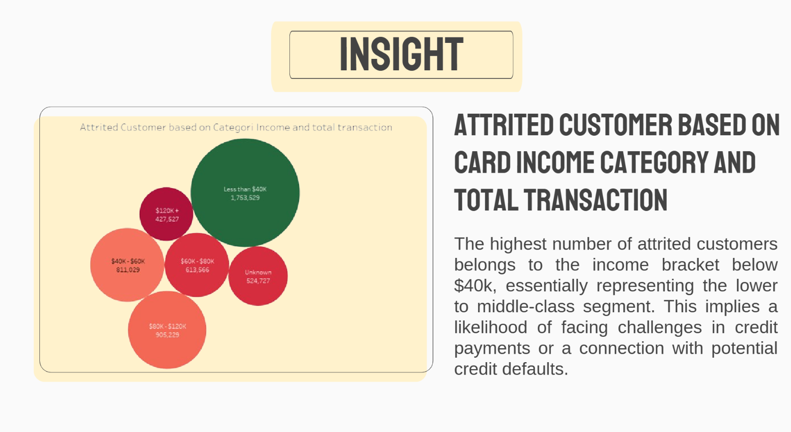

# Project Based Internship as a Data Engineer BTPN Syariah x Rakamin Academy

## Prerequisite
- Memiliki Tableau dan MySQL / PostgreSQL / Microsoft SQL Developer
- Mendowload Data Final Project (Berisi 5 File Database Kategori Kartu Kredit, Tingkat Pendidikan, Pernikahan, Status, dan Data Kartu Kredit Customer)

## Case Study
Seorang manajer di bank merasa terganggu dengan semakin banyak pelanggan yang meninggalkan layanan kartu kredit mereka. Mereka akan sangat menghargai jika seseorang
dapat mengetahui profil pelanggan sehingga mereka dapat mengetahui pelanggan mana yang akan pergi sehingga mereka dapat secara proaktif mendatangi pelanggan untuk
memberikan layanan yang lebih baik dan mengubah keputusan pelanggan ke arah yang berlawanan.

# Steps in Project
a. Business Objective : 
- Mengidentifikasi faktor apa saja yang menjadi penyebab customer terlambat membayar tunggakan credit
- Visualisasi kondisi customer yang memiliki pembayaran kredit tertunda
- Menentukan factor yang paling banyak menjadi penyebab customer menunggak
  
b. Data Exploration (Mempresentasikan query dari database yang telah disediakan) :
- Menggabungkan data kelima database
- Melakukan Analisis penggunaan kartu kredit berdasarkan pengelompokkan Gender dan dari Persepktif Pendapatan 

c. Insight Presentation (Memberikan Insgith dari Visualiasi Data yang telah diproses menggunakan Tools Visualsasi Tableau)
- Insight 1 :

- Insight 2 :

d. Kesimpulan dan Saran 
-Kesimpulan : Koreksi tingkat pendapatan dan interaksi nasabah-bank sangat penting untuk memahami dan menangani churn nasabah, di mana churn cenderung meningkat seiring dengan penurunan pendapatan.

- Saran : Melakukan analisis mendalam terhadap perilaku pembelian nasabah, termasuk cara mereka berinteraksi dengan produk dan layanan,
serta terapkan inisiatif retensi yang fokus seperti pesan personal melalui email atau WhatsApp untuk nasabah yang menunjukkan tanda-tanda akan pergi.

